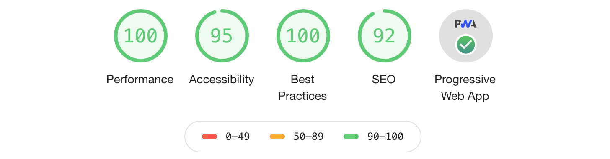

[![build][travis-ci-image]][travis-ci-url]
[![Dependency status][david-dm-image]][david-dm-url]
[![Dev Dependency status][david-dm-dev-image]][david-dm-dev-url]
[![Known Vulnerabilities][snyk-image]][snyk-url]

# angular-pwa-sample



This is a PWA sample using Angular CLI.

This sample contains following features.
- Angular Service Worker
- App Shell with Angular Universal

## Tutorial

1. Install Angular CLI

```shell
$ npm i -g @angular/cli
```

2. Create an app

```shell
$ ng new my-app --routing --style=css
$ cd my-app
```

3. Add service worker

```shell
$ ng add @angular/pwa --project=my-app
```

4. Generate App Shell

```shell
$ ng g app-shell --client-project=my-app --universal-project=my-app
```

5. Run `ng run` to build the app

```shell
$ ng run my-app:app-shell:production
```

Congratulations ! Your Angular application is built in `dist/my-app`.

You can see the app by using a static file server.

```
$ npx serve -s ./dist/my-app
```

[travis-ci-url]: http://travis-ci.org/puku0x/angular-pwa-sample
[travis-ci-image]: https://travis-ci.org/puku0x/angular-pwa-sample.svg?branch=master
[david-dm-url]:https://david-dm.org/puku0x/angular-pwa-sample
[david-dm-image]:https://david-dm.org/puku0x/angular-pwa-sample.svg
[david-dm-dev-url]:https://david-dm.org/puku0x/angular-pwa-sample?type=dev
[david-dm-dev-image]:https://david-dm.org/puku0x/angular-pwa-sample/dev-status.svg
[snyk-url]: https://snyk.io/test/github/puku0x/angular-pwa-sample
[snyk-image]: https://snyk.io/test/github/puku0x/angular-pwa-sample/badge.svg
